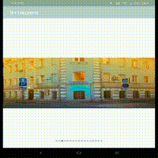

## android简单的图片查看器，带小圆点

### 效果



### 添加xml界面

#### activity_show_big_img.xml  图片查看主页面

```xml
<?xml version="1.0" encoding="utf-8"?>
<RelativeLayout xmlns:android="http://schemas.android.com/apk/res/android"
    xmlns:app="http://schemas.android.com/apk/res-auto"
    xmlns:tools="http://schemas.android.com/tools"
    android:layout_width="match_parent"
    android:layout_height="match_parent"
    tools:context=".ShowBigImgActivity">
    <androidx.viewpager.widget.ViewPager
        android:id="@+id/show_big_viewPager"
        android:layout_width="match_parent"
        android:layout_height="wrap_content"/>

    <LinearLayout
        android:id="@+id/view_indicator"
        android:layout_width="wrap_content"
        android:layout_height="wrap_content"
        android:layout_alignParentBottom="true"
        android:layout_marginBottom="30dp"
        android:layout_centerInParent="true"
        android:orientation="horizontal" >
    </LinearLayout>
</RelativeLayout>
```

- **ViewPager** -用于切换图片
- **LinearLayout** -用于添加小圆点

#### show_big_img.xml   用于显示图片

```xml
<?xml version="1.0" encoding="utf-8"?>
<RelativeLayout xmlns:android="http://schemas.android.com/apk/res/android"
    android:orientation="vertical" android:layout_width="match_parent"
    android:layout_height="match_parent">
    <ProgressBar
        android:layout_centerInParent="true"
        android:layout_width="50dp"
        android:layout_height="50dp"/>

    <ImageView
        android:id="@+id/big_img_view"
        android:background="#99A4B8"
        android:layout_centerInParent="true"
        android:layout_width="match_parent"
        android:layout_height="wrap_content"/>

</RelativeLayout>
```

- **ProgressBar** ：图片未加载出来时显示加载的画面
- **ImageView** ：用于图片显示
- 都居中显示，图片加载出来会覆盖**ProgressBar**

### 显示图片

- ViewPager适配器

```kotlin
package com.example.myapplication

import android.view.View
import android.view.ViewGroup
import androidx.core.view.get
import androidx.viewpager.widget.PagerAdapter
import kotlinx.android.synthetic.main.show_big_img.view.*

/**
 * @param viewLists view列表
 * @param imgUrlList 图片地址列表
 */
class BigViewPagerAdapter(private val viewLists:ArrayList<View>, private val imgUrlList:ArrayList<String>) : PagerAdapter() {

    override fun getCount(): Int {
        return viewLists.size
    }
    
    override fun isViewFromObject(view: View, `object`: Any): Boolean {
        return view == `object`
    }

    override fun instantiateItem(container: ViewGroup, position: Int): Any {
        container.addView(viewLists[position])
        return viewLists[position]
    }

    override fun destroyItem(container: ViewGroup, position: Int, `object`: Any) {
        container.removeView(viewLists[position])
    }
}
```

- activity文件

```kotlin
class ShowBigImgActivity : AppCompatActivity() {
    override fun onCreate(savedInstanceState: Bundle?) {
            super.onCreate(savedInstanceState)
        setContentView(R.layout.activity_show_big_img)
		// 获取图片地址列表，自己定义的
        val imgUrlList = intent.getStringArrayListExtra("imgList") as ArrayList<String>
        // 点击第几张图片
		var index_position = intent.getIntExtra("position", 0)
        val viewList = ArrayList<View>()
        // 获取图片view列表
        for(imgUrl in imgUrlList){
            val view = layoutInflater.inflate(R.layout.show_big_img, null, false)
            Glide.with(view)
                .load(imgUrl)
                .dontAnimate()
                .into(view.big_img_view)
            viewList!!.add(view)
        }
        // 添加view列表到ViewPager中
        show_big_viewPager.adapter = BigViewPagerAdapter(viewList!!, imgUrlList)
        // 设置初始加载时点击的图片位置
        show_big_viewPager.currentItem = index_position
    }
}
```

- 这里获取图片列表，根据列表数量创建view数量，把view添加到viewPager中

### 添加小圆点

```kotlin
 for(imgUrl in imgUrlList){ 	
 	......
 	val imageView = ImageView(view.context);
    imageView.layoutParams = ViewGroup.LayoutParams(20, 20)
    imageView.setPadding(20, 0, 20, 0)
    imageView.setBackgroundResource(R.drawable.indicator)
    view_indicator.addView(imageView)
}
// 设置点击图片的小圆点的状态        
        view_indicator[index_position].setBackgroundResource(R.drawable.indicator_cur)
```

- 向view_indicator （activity_show_big_img.xml文件的LinearLayout）中添加小圆点
- 根据图片数量创建小圆点，并设置小圆点初始下的状态（图片），并设置点击的图片的小圆点

```kotlin

    show_big_viewPager.addOnPageChangeListener(
        object : OnPageChangeListener {
            override fun onPageScrolled(position: Int, positionOffset: Float, positionOffsetPixels: Int) {}

            override fun onPageSelected(position: Int) {
                // 设置当前点
            view_indicator[position].setBackgroundResource(R.drawable.indicator_cur)
                //下面就是获取上一个位置，并且把点的状体设置成默认状体
                view_indicator[index_position].setBackgroundResource(R.drawable.indicator)
                //下面是记录本次的位置，因为在滑动，他就会变成过时的点了
                index_position = position
            }

            override fun onPageScrollStateChanged(state: Int) {}
        })
```

- 获取显示图片的位置，设置小圆点状态并把前面显示的小圆点变为初始状态