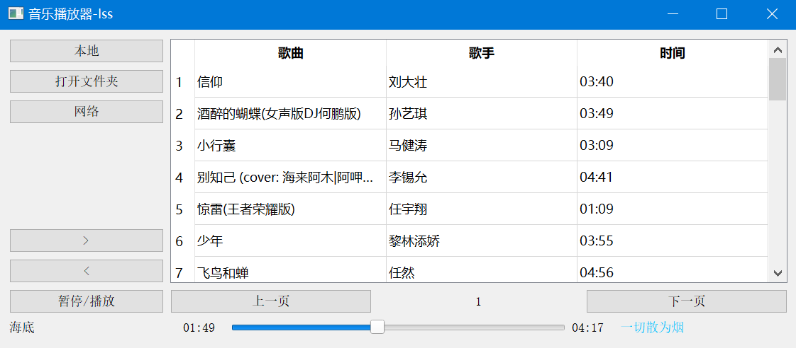

### 效果



### 说明

- 打开文件夹：选择本地音乐文件夹
- 网络：酷我的一个排行榜api（忘了是哪个了）
- \> ：下一首
- \< ：上一首
- 左下角：歌曲名
- 右下角：歌词（只能显示网络的）

### 代码

```python
import os
from kwapi import get_music_list, get_music_url, get_lrc
import sys
import time
import qdarkstyle

from PyQt5.QtCore import QUrl, Qt, QTimer
from PyQt5.QtGui import QStandardItem, QStandardItemModel
from PyQt5.QtMultimedia import QMediaContent, QMediaPlayer, QMediaPlaylist
from PyQt5.QtWidgets import (QAbstractItemView, QApplication, QFileDialog, QHBoxLayout, QHeaderView, QLabel,
                             QMainWindow, QSlider, QTableView, QWidget, QVBoxLayout,
                             QPushButton, QStyleFactory)


class First_M(QMainWindow):

    def __init__(self):
        super(First_M, self).__init__()

        self.setWindowTitle('音乐播放器-lss')
        self.resize(1000, 420)
        # 添加中心控件
        main_frame = QWidget()
        self.setCentralWidget(main_frame)

        self.hlayout = QHBoxLayout()
        self.vlayout = QVBoxLayout()
        self.vlayout.addLayout(self.hlayout)
        main_frame.setLayout(self.vlayout)

        self.status = self.statusBar()   # 状态提示栏
        self.music_list = []   # 保存音乐列表
        self.music_lrc = {}   # 当前播放音乐的歌词
        self.local = False   # 用来判断是网络还是本地
        self.bangId = 93   # 排行榜
        self.pn = 1   # 页码
        self.cur_path = 'H:/音乐/'   # 打开音乐位置

        # 自定义的方法
        self.set_left()   # 左边设置
        self.set_right()   # 右边设置
        self.set_mediaplayer()   # 播放器
        self.all_singa()   # 一些信号
        self.set_slider()    # 下边设置
        self.set_local_music()    # 本地音乐
    
    
    def set_left(self):
        """一些按钮"""
        self.button_local = QPushButton('本地')
        self.button_network = QPushButton('网络')
        self.button_open_dir = QPushButton('打开文件夹')

        self.button_next = QPushButton('>')
        self.button_pause = QPushButton('暂停/播放')
        self.button_pre = QPushButton('<')

        vlayout = QVBoxLayout()   # 垂直布局
        vlayout.addWidget(self.button_local, )
        vlayout.addWidget(self.button_open_dir)
        vlayout.addWidget(self.button_network, alignment=Qt.AlignTop)

        vlayout.addWidget(self.button_next)
        vlayout.addWidget(self.button_pre)
        vlayout.addWidget(self.button_pause, )
        self.hlayout.addLayout(vlayout, 1)

    def set_right(self):
        self.model = QStandardItemModel(0, 3)
        self.model.setHorizontalHeaderLabels(['歌曲', '歌手', '时间'])
        self.table = QTableView()
        self.table.setModel(self.model)


        self.button_pre_page = QPushButton('上一页')
        self.label_pn = QLabel('1')
        self.button_next_page = QPushButton('下一页')

        self.button_pre_page.clicked.connect(self.set_pre_pn)
        self.button_next_page.clicked.connect(self.set_next_pn)

        hlayout = QHBoxLayout()
        hlayout.addWidget(self.button_pre_page)
        hlayout.addWidget(self.label_pn, alignment=Qt.AlignCenter)
        hlayout.addWidget(self.button_next_page)
        

        # 设置选中整行
        self.table.setSelectionBehavior(QAbstractItemView.SelectRows)
        # 设置跟随窗口变化
        self.table.horizontalHeader().setSectionResizeMode(QHeaderView.Stretch)

        vlayout = QVBoxLayout()   # 垂直布局
        vlayout.addWidget(self.table)
        vlayout.addLayout(hlayout)

        self.hlayout.addLayout(vlayout, 4)

    def set_mediaplayer(self):
        """播放器"""
        self.player = QMediaPlayer()  # 初始化播放器
        self.play_list = QMediaPlaylist()   # # 播放列表
    
    def set_slider(self):
        """下边的播放信息"""
        self.label_name = QLabel()
        self.label1 = QLabel('00:00')
        self.label2 = QLabel('00:00')

        self.label_lrc = QLabel()   # 显示歌词
        self.label_lrc.setStyleSheet("color:DeepSkyBlue;")   # 设置歌词颜色

        self.slider = QSlider(Qt.Horizontal)   # 水平滑块
        self.slider.setMinimum(0)   # 滑块控件最小值


        # 记时器， 每秒执行一次self.play_slider
        self.timer = QTimer(self)
        self.timer.start(1000)
        self.timer.timeout.connect(self.play_slider)
        
        hlayout = QHBoxLayout()
        hlayout.addWidget(self.label_name, 4)   # 4 占比
        hlayout.addWidget(self.label1, 1)
        hlayout.addWidget(self.slider, 8)
        hlayout.addWidget(self.label2, 1)
        hlayout.addWidget(self.label_lrc, 4)

        self.vlayout.addLayout(hlayout)

        # 链接滑块和播放
        self.slider.sliderMoved[int].connect(lambda: self.player.setPosition(self.slider.value()))

        # 设置风格
        self.label1.setStyle(QStyleFactory.create('Fusion'))
        self.label2.setStyle(QStyleFactory.create('Fusion'))
        self.slider.setStyle(QStyleFactory.create('Fusion'))

    def open_dir(self):
        """打开文件夹，选择音乐"""
        self.cur_path = QFileDialog.getExistingDirectory(
            self, 'open_dir', '/media/lss/Linux Windows')
        self.set_local_music()

    def set_next_pn(self):
        """设置排行榜页码, 下一页"""
        if not self.local:
            self.pn += 1
            self.label_pn.setText(str(self.pn))
            self.set_network_music()
    
    def set_pre_pn(self):
        """设置排行榜页码, 上一页"""
        if not self.local:
            if self.pn > 1:
                self.pn -= 1
                self.label_pn.setText(str(self.pn))
                self.set_network_music()

    def play_slider(self):
        """设置滑动条动起来""" 
        if self.player.position() <2000 and self.player.duration() != 0:
            self.label2.setText(time.strftime(
                '%M:%S', time.localtime(self.player.duration()/1000)))
            self.slider.setMaximum(self.player.duration())   # 设置滑块控件最大值

        if self.player.state() == 1:
            self.slider.setValue(self.slider.value() + 1000)   # 滑块移动
            self.label1.setText(time.strftime('%M:%S', time.localtime(self.player.position()/1000)))
            
            # 设置歌词
            if self.label1.text() in self.music_lrc:
                self.label_lrc.setText(self.music_lrc[self.label1.text()])
        
        # 下一首
        if self.player.duration() != 0 and self.player.position() == self.player.duration() :
            self.next_music()
                
    def add_data(self):
        """右边添加数据"""
        if self.music_list:
            for music in self.music_list:
                self.model.appendRow([  # 添加一行数据
                    QStandardItem(music['name']),
                    QStandardItem(music['artist']),
                    QStandardItem(music['songTimeMinutes'])
                ])

    def all_singa(self):
        """一些信号"""
        self.table.doubleClicked.connect(self.doubleClicked_music)   # 双击播放
        self.button_local.clicked.connect(self.set_local_music)
        self.button_network.clicked.connect(self.set_network_music)
        self.button_open_dir.clicked.connect(self.open_dir)
        self.button_pre.clicked.connect(self.pre_music)
        self.button_next.clicked.connect(self.next_music)
        self.button_pause.clicked.connect(self.pause_music)
    
    def doubleClicked_music(self):
        """获取双击位置"""
        self.slider.setValue(0)
        self.index = self.table.currentIndex().row()
        self.play_music()

    def set_local_music(self):
        """本地音乐"""
        self.local = True
        self.remove_model()
        try:
            name_lsit = os.listdir(self.cur_path)
        except:
            pass
        else:
            for name in name_lsit:
                if name[-3:] == "mp3" or name[-3] == "MP3":
                    path_name = os.path.join(self.cur_path, name)
                    self.music_list.append({
                        'url': path_name,
                        'name': name[:-4],
                        'artist':'',
                        'songTimeMinutes':''
                        })
            self.add_data()

    def set_network_music(self):
        """网络音乐"""
        self.local = False
        self.remove_model()
        self.music_list = get_music_list(self.bangId, self.pn)
        self.add_data()

    def remove_model(self):
        """清空音乐列表"""
        for i in range(len(self.music_list)):
            self.model.removeRow(0)
        self.music_list = []

    def next_music(self):
        """下一首"""
        if self.index < len(self.music_list) - 1:
            self.index += 1
        else:
            self.index = 0
        self.play_music()

    def pre_music(self):
        """上一首"""
        if self.index > 0:
            self.index -= 1
        else:
            self.index = len(self.music_list) - 1
        self.play_music()

    def pause_music(self):
        """暂停/播放"""
        if self.player.state() == 1:
            self.player.pause()
        else:
            self.player.play()

    def play_music(self):
        """播放音乐"""
        if not self.music_list[self.index]['url']:
            rid = self.music_list[self.index]['rid']
            url = get_music_url(rid)
            self.music_lrc = get_lrc(rid)
        else:
            url = self.music_list[self.index]['url']
            
        if not self.local:
            # 添加音乐到播放器中
            self.player.setMedia(QMediaContent(QUrl(url)))
        else:
            self.player.setMedia(QMediaContent(QUrl.fromLocalFile(url)))

        self.player.play()
        self.slider.setValue(0)
        self.label_name.setText(self.music_list[self.index]['name'])

if __name__ == "__main__":
    app = QApplication(sys.argv)
    # app.setStyleSheet(qdarkstyle.load_stylesheet_pyqt5())
    ui = First_M()
    ui.show()
    sys.exit(app.exec_())

```

kwapi.py

```python
'''
@encoding: utf-8
@Author: lss
@Date: 2020-07-07 21:40:52
@LastEditTime: 2020-07-10 00:53:21
@Description: file content
'''
import requests


headers = {
    'User-Agent': 'Mozilla/5.0 (Windows NT 10.0; Win64; x64; rv:67.0) Gecko/20100101 Firefox/67.0',
    'Cookie': 'kw_token=6A3S4588YMS',
    'csrf': '6A3S4588YMS'
}

def get_music_list(bangId=93, pn=1):
    """获取音乐列表return list -> dict:rid, name, songTimeMinutes, artist"""
    url = 'http://www.kuwo.cn/api/www/bang/bang/musicList?bangId={0}&pn={1}&rn=30'.format(bangId, pn)
    text_json = requests.get(url, headers=headers).json()
    musicList = text_json['data']['musicList']
    dit = {}
    music_list = []

    for music in musicList:
        dit['rid'] = music['musicrid'].split('_')[1]
        dit['name'] = music['name']
        dit['songTimeMinutes'] = music['songTimeMinutes']
        dit['artist'] = music['artist']
        dit['url'] = ''
        music_list.append(dit.copy())
    return music_list

def get_music_url(rid):
    """获取歌曲地址"""
    rid_url = 'http://www.kuwo.cn/url?format=mp3&rid={}&response=url&type=convert_url3'.format(rid)
    resp_json = requests.get(rid_url, headers=headers).json()
    music_url = resp_json['url']
    return music_url

def get_lrc(rid):
    """获取歌词"""
    lrc_url = 'http://m.kuwo.cn/newh5/singles/songinfoandlrc?musicId={0}'.format(rid)
    resp = requests.get(lrc_url, headers=headers)
    lrc_dict = {}
    for lrc in resp.json()['data']['lrclist']:
        lrc_time = lrc['time'].split('.')[0]
        if  int(lrc_time) > 60:
            seconds = int(lrc_time) % 60
            minute = int(lrc_time) // 60
            if seconds < 10:
                seconds = f'0{seconds}'
            lrc_time = f'0{minute}:{seconds}'
        else:
            seconds = int(lrc_time)
            if seconds < 10:
                lrc_time = f'00:0{seconds}'
            else:
                lrc_time = f'00:{seconds}'
        lrc_dict[lrc_time] = lrc['lineLyric']
        
    return lrc_dict

if __name__ == "__main__":
    rid = get_music_list()[0]['rid']
    music_lrc = get_lrc(rid)


```

