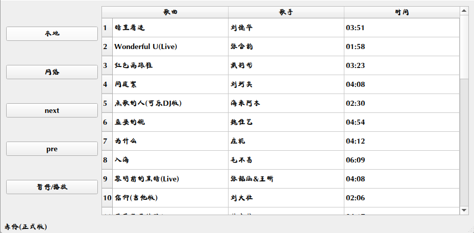
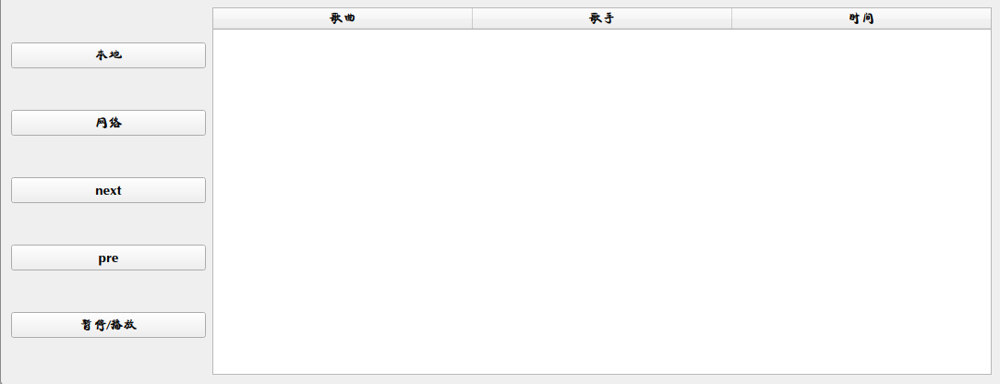

### 效果



### 说明

- 本地：指定文件夹打开文件夹里面的mp3文件
- 网络：从酷我排行榜api的一页加载到页面
- next：当前页面的下一首歌
- pre：上一首
- 在提示状态栏显示当前播放的音乐

### 实现

- 导入

- ```python
  import os
  import sys
  
  from PyQt5.QtCore import QUrl
  from PyQt5.QtGui import QStandardItem, QStandardItemModel
  from PyQt5.QtMultimedia import QMediaContent, QMediaPlayer, QMediaPlaylist
  from PyQt5.QtWidgets import (QApplication, QHBoxLayout, QHeaderView,
                               QMainWindow, QTableView, QWidget, QVBoxLayout,
                               QPushButton)
  ```

### 框架搭建

- ```python
  class First_M(QMainWindow):
      def __init__(self):
          super(First_M, self).__init__()
          self.resize(1084, 420)
          self.hlayout = QHBoxLayout()
          
          main_frame = QWidget()
          main_frame.setLayout(self.hlayout)
          self.setCentralWidget(main_frame)
  ```
  - 水平布局用于添加左右窗口

  ```python
  self.hlayout = QHBoxLayout()
  ```

  - 设置中心窗口部件并添加水平布局

  ```python
  main_frame = QWidget()
  main_frame.setLayout(self.hlayout)
  self.setCentralWidget(main_frame)
  ```

- ```python
  def set_left(self):
      """一些按钮"""
      self.button1 = QPushButton('本地')
      self.button2 = QPushButton('网络')
      self.button_next = QPushButton('next')
      self.button_pre = QPushButton('pre')
      self.button_pause = QPushButton('暂停/播放')
      
      vlayout = QVBoxLayout()   # 垂直布局
      vlayout.addWidget(self.button1)
      vlayout.addWidget(self.button2)
      vlayout.addWidget(self.button_next)
      vlayout.addWidget(self.button_pre)
      vlayout.addWidget(self.button_pause)
      self.hlayout.addLayout(vlayout, 1)
  ```
  - 建立五个QPushButton，然后添加到垂直布局中

  - 把垂直布局添加到水平布局中，设置占比为1（右边设置为4）

    ```python
    self.hlayout.addLayout(vlayout, 1)
    ```

- ```python
  def set_right(self):
  	self.model = QStandardItemModel(0, 3)
      self.model.setHorizontalHeaderLabels(['歌曲', '歌手', '时间'])
      self.table = QTableView()
      self.table.setModel(self.model)  
      self.table.horizontalHeader().setSectionResizeMode(QHeaderView.Stretch)
      
      vlayout = QVBoxLayout()   # 垂直布局
      vlayout.addWidget(self.table)
      self.hlayout.addLayout(vlayout, 4)
  ```

  - 创建模型对象，为3列

    ```python
    self.model = QStandardItemModel(0, 2)
    ```

  - 设置各列标题

    ```python
    self.model.setHorizontalHeaderLabels(['歌曲', '歌手', '时间'])
    ```

  - 用来显示数据

    ```python
    self.table = QTableView()
    ```

  - 把数据添加至QtableView中

    ```python
    self.table.setModel(self.model)
    ```

  - 设置列宽随屏幕大小变化而变化

    ```python
    self.table.horizontalHeader().setSectionResizeMode(QHeaderView.Stretch)
    ```

  - 把显示数据添加到垂直布局中，并把垂直布局添加到水平布局中

    ```python
    vlayout = QVBoxLayout()   # 垂直布局
    vlayout.addWidget(self.table)
    self.hlayout.addLayout(vlayout, 4)
    ```

- 添加播放器

  ```python
  def set_mediaplayer(self):
      """播放器"""
      self.player = QMediaPlayer()  # 初始化播放器
      self.play_list = QMediaPlaylist()   # # 播放列表
  ```

- 在`__init__`最后添加

  ```python
  self.set_left()
  self.set_right()
  self.set_mediaplayer()
  ```

- 效果

  

### 右边添加数据

#### 获取数据，酷我api

- kwapi.py文件

```python
import requests

headers = {
    'User-Agent': 'Mozilla/5.0 (Windows NT 10.0; Win64; x64; rv:67.0) Gecko/20100101 Firefox/67.0',
    'Cookie': 'kw_token=6A3S4588YMS',
    'csrf': '6A3S4588YMS'
}

def get_music_list(bangId=93, pn=1):
    """返回dict: rid, name, songTimeMinutes, artist"""
    url = 'http://www.kuwo.cn/api/www/bang/bang/musicList?bangId={0}&pn={1}&rn=30'.format(bangId, pn)
    text_json = requests.get(url, headers=headers).json()
    musicList = text_json['data']['musicList']
    dit = {}
    music_list = []
    for music in musicList:
        dit['rid'] = music['musicrid'].split('_')[1]
        dit['name'] = music['name']
        dit['songTimeMinutes'] = music['songTimeMinutes']
        dit['artist'] = music['artist']
        dit['url'] = ''
        music_list.append(dit.copy())
    return music_list

def get_music_url(rid):
    """获取歌曲地址"""
    print(rid)
    rid_url = 'http://www.kuwo.cn/url?format=mp3&rid={}&response=url&type=convert_url3'.format(rid)
    resp_json = requests.get(rid_url, headers=headers).json()
    music_url = resp_json['url']
    return music_url
```

#### 添加数据到右边

```python
from kwapi import get_music_list
def add_data(self):
    if self.music_list:
        for music in self.music_list:
            self.model.appendRow([  # 添加一行数据
                QStandardItem(music['name']),
                QStandardItem(music['artist']),
                QStandardItem(music['songTimeMinutes'])
            ])
```

#### 信号与槽

```python
def all_singa(self):
    """全部信号"""
    # 双击音乐列表播放
    self.table.doubleClicked.connect(self.doubleClicked_music)
    # 单击本地按钮改变音乐列表
    self.button1.clicked.connect(self.set_local_music)
    # 单击网络
    self.button2.clicked.connect(self.set_network_list)
    self.button_pre.clicked.connect(self.pre_music)
    self.button_next.clicked.connect(self.next_music)
    self.button_pause.clicked.connect(self.pause_music)

def doubleClicked_music(self):
    """获取双击位置"""
    self.index = self.table.currentIndex().row()
    self.paly_music()   # 播放音乐后面会有
   
def set_local_music(self):
    """设置音乐列表为本地"""
    self.local = True
    self.remove_model()
    path = '/media/lss/Linux Windows/音乐/'   # 本地地址
    name_lsit = os.listdir(path)
    for name in name_lsit:
        if name[-3:] == "mp3" or name[-3] == "MP3":
            path_name = os.path.join(path, name)
            self.music_list.append({
                'url': path_name,
                'name': name,
                'artist':'',
                'songTimeMinutes':''
            })
	self.add_data()
    
def set_network_music(self):
    """设置音乐列表为网络"""
    self.local = False
    self.remove_model()
    self.music_list = get_music_list()
    self.add_data()
    
def remove_model(self):
    """清空音乐列表"""
    for i in range(len(self.music_list)):
        self.model.removeRow(0)
    self.music_list = []

def next_music(self):
    """下一首"""
    if self.index < len(self.music_list) - 1:
        self.index += 1
    else:
        self.index = 0
    self.play_music()

def pre_music(self):
    """上一首"""
    if self.index > 0:
        self.index -= 1
    else:
        self.index = len(self.music_list) - 1
    self.play_music()

def pause_music(self):
    """暂停/播放"""
    if self.player.state() == 1:
        self.player.pause()
    else:
        self.player.play()

```

#### 播放

```python
def paly_music(self):
    """播放音乐"""
    if not self.music_list[self.index]['url']:
        rid = self.music_list[self.index]['rid']
        url = get_music_url(rid)
        print(url)
    else:
    	url = self.music_list[self.index]['url']
    if not self.local:
        # 添加音乐到播放器中
        self.player.setMedia(QMediaContent(QUrl(url)))
    else:
        self.player.setMedia(QMediaContent(QUrl.fromLocalFile(url)))
    self.player.play()   # 播放
```

- 添加音乐到播放器中

  ```python
  self.player.setMedia(QMediaContent(QUrl.fromLocalFile(url)))
  ```

  #在windows中下面的网络和本地都可以，而在linux中只能本地，网络的要用

  ```python
  self.player.setMedia(QMediaContent(QUrl(url)))
  ```


### 代码

kwapi.py文件前面有了

```python
import os
from kwapi import get_music_list, get_music_url
import sys

from PyQt5.QtCore import QUrl
from PyQt5.QtGui import QStandardItem, QStandardItemModel
from PyQt5.QtMultimedia import QMediaContent, QMediaPlayer, QMediaPlaylist
from PyQt5.QtWidgets import (QApplication, QHBoxLayout, QHeaderView,
                             QMainWindow, QTableView, QWidget, QVBoxLayout,
                             QPushButton)


class First_M(QMainWindow):
    def __init__(self):
        super(First_M, self).__init__()
        self.resize(1084, 420)
        self.hlayout = QHBoxLayout()
        self.status = self.statusBar()   # 状态提示栏

        self.music_list = []

        main_frame = QWidget()
        main_frame.setLayout(self.hlayout)
        self.setCentralWidget(main_frame)

        self.set_left()
        self.set_right()
        self.set_mediaplayer()
        self.all_singa()

        self.local = False   # 是网络还是本地
        self.set_local_music()

    def set_left(self):
        """一些按钮"""
        self.button1 = QPushButton('本地')
        self.button2 = QPushButton('网络')
        self.button_next = QPushButton('next')
        self.button_pre = QPushButton('pre')
        self.button_pause = QPushButton('暂停/播放')

        vlayout = QVBoxLayout()   # 垂直布局
        vlayout.addWidget(self.button1)
        vlayout.addWidget(self.button2)
        vlayout.addWidget(self.button_next)
        vlayout.addWidget(self.button_pre)
        vlayout.addWidget(self.button_pause)
        self.hlayout.addLayout(vlayout, 1)
    
    def set_right(self):
        self.model = QStandardItemModel(0, 3)
        self.model.setHorizontalHeaderLabels(['歌曲', '歌手', '时间'])
        self.table = QTableView()
        self.table.setModel(self.model)
        self.table.horizontalHeader().setSectionResizeMode(QHeaderView.Stretch)
        vlayout = QVBoxLayout()   # 垂直布局
        vlayout.addWidget(self.table)
        self.hlayout.addLayout(vlayout, 4)
    
    def set_mediaplayer(self):
        """播放器"""
        self.player = QMediaPlayer()  # 初始化播放器
        self.play_list = QMediaPlaylist()   # # 播放列表

    def add_data(self):
        if self.music_list:
            for music in self.music_list:
                self.model.appendRow([  # 添加一行数据
                    QStandardItem(music['name']),
                    QStandardItem(music['artist']),
                    QStandardItem(music['songTimeMinutes'])
                ])

    def all_singa(self):
        """全部信号"""
        self.table.doubleClicked.connect(self.doubleClicked_music)   # 双击播放
        self.button1.clicked.connect(self.set_local_music)
        self.button2.clicked.connect(self.set_network_music)
        self.button_pre.clicked.connect(self.pre_music)
        self.button_next.clicked.connect(self.next_music)
        self.button_pause.clicked.connect(self.pause_music)
    
    def doubleClicked_music(self):
        """获取双击位置"""
        self.index = self.table.currentIndex().row()
        self.play_music()

    def set_local_music(self):
        """设置音乐列表为本地文件"""
        self.local = True
        self.remove_model()
        # 自己设置路径
        path = '/media/lss/Linux Windows/音乐/'
        name_lsit = os.listdir(path)
        for name in name_lsit:
            if name[-3:] == "mp3" or name[-3] == "MP3":
                path_name = os.path.join(path, name)
                self.music_list.append({
                    'url': path_name,
                    'name': name,
                    'artist':'',
                    'songTimeMinutes':''
                    })
        self.add_data()

    def set_network_music(self):
        """设置音乐列表为网络数据"""
        self.local = False
        self.remove_model()
        self.music_list = get_music_list()
        self.add_data()

    def remove_model(self):
        """清空音乐列表"""
        for i in range(len(self.music_list)):
            self.model.removeRow(0)
        self.music_list = []

    def next_music(self):
        """下一首"""
        if self.index < len(self.music_list) - 1:
            self.index += 1
        else:
            self.index = 0
        self.play_music()

    def pre_music(self):
        """上一首"""
        if self.index > 0:
            self.index -= 1
        else:
            self.index = len(self.music_list) - 1
        self.play_music()

    def pause_music(self):
        """暂停/播放"""
        if self.player.state() == 1:
            self.player.pause()
        else:
            self.player.play()

    def play_music(self):
        """播放音乐"""
        if not self.music_list[self.index]['url']:
            rid = self.music_list[self.index]['rid']
            url = get_music_url(rid)
        else:
            url = self.music_list[self.index]['url']
            
        if not self.local:
            # 添加音乐到播放器中
            self.player.setMedia(QMediaContent(QUrl(url)))
        else:
            self.player.setMedia(QMediaContent(QUrl.fromLocalFile(url)))
        self.player.play()
        self.status.showMessage(self.music_list[self.index]['name'])

    
if __name__ == "__main__":
    app = QApplication(sys.argv)
    ui = First_M()
    ui.show()
    sys.exit(app.exec_())

```

