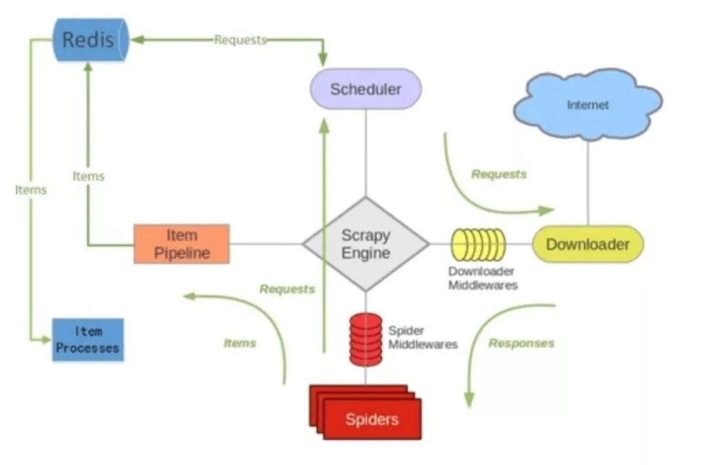

## scrapy-redis

### 介绍

- Scrapy 是一个框架，他本身是不支持分布式的。如果我们想要做分布式的爬虫，就需要借助一个组件叫做 Scrapy-Redis，这个组件正是利用了 Redis 可以分布式的功能，集成到 Scrapy 框架中，使得爬虫可以进行分布式。

### scrapy与scrapy-redis

- scrapy

  - scrapy原理图

    

  - 其中`Scheduler`负责`Request`对象的入列和出列的操作，`Request`对象保存在队列（queue）中。

- scrapy-redis

  

  - scrapy与scrapy-redis对比，scrapy-redis只是多了一个redis，还把items、Request对象保存到redis中。

### scrapy-redis分布式原理

- scrapy的Request对象保存在队列（queue）中，当停止爬虫时，Request对象也随之消失了，我们下次爬取的时候还要重新请求。
- 而在scrapy-redis中，Request对象保存在redis中。停止爬虫，Request对象不会随之消失，还在redis中，下次开始爬虫时，读取redis中的Request对象，这样就不会重新请求了。当然也可以多台机器一起请求，只要redis是同一个就好了。

### redis中数据的保存

在redis中建立了三个数据库来保存items和Request对象。下面domz是爬虫名

- `dmoz:requests`：用来保存还没请求过的Request对象，爬虫每次启动时都会从中取出Request对象发起请求，直到为空

- `domz:items`：用来保存要爬取的数据，返回的item对象。
- `dmoz:dupefilter`：用来保存请求过的Request对象，每个代表着一个‘指纹’，防止重复抓取。