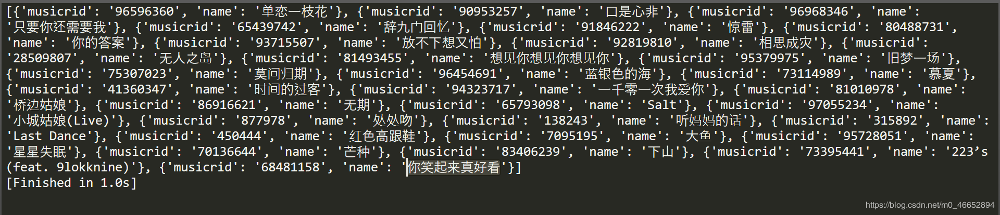
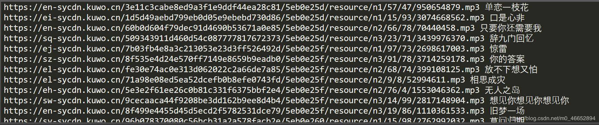

[TOC]
## 酷我爬取

目标：爬取酷我排行榜：`http://www.kuwo.cn/rankList`

####  获取歌曲地址：即 `mp3` 文件地址

##### 1、地址在哪？

随便播放一首歌比如：
```
http://www.kuwo.cn/play_detail/96596360
```

发现歌曲地址在：

```
http://www.kuwo.cn/url?format=mp3&rid=96596360&response=url&type=convert_url3&br=128kmp3&from=web&t=1588644908796&reqId=3e2308f0-8e76-11ea-8d1e-e3a5379bd1fc
```


通过请求发现可以删掉一些变成这样：

```python
http://www.kuwo.cn/url?format=mp3&rid=96596360&response=url&type=convert_url3
```

##### 2、寻找规律

再播放一首歌：
```
http://www.kuwo.cn/play_detail/96968346
```

歌曲地址在：

```python
http://www.kuwo.cn/url?format=mp3&rid=96968346&response=url&type=convert_url3
```

对比上面两首歌发现只有`rid`不一样。
那可以改变`rid`来获取不同的歌曲

##### 3、获取rid

播放歌曲的时候地址栏就有rid，说明在排行榜页就可以得到rid

查看网页源代码，搜索排行榜的一首歌的rid,比如：96968346，搜索没有。

那就看看是不是`json数据`，刷新排行榜，发现


```python
http://www.kuwo.cn/api/www/bang/bang/musicList?bangId=93&pn=1&rn=30&reqId=116d9510-8e7a-11ea-9b6a-9fa81e930ebc
```

里面有

```
musicrid: "MUSIC_96968346"
```

刚好有30个 

请求发现

```
{"success":false,"message":"CSRF Token Not Found!","now":"2020-05-05T02:52:58.679Z"}
```

没有得到正确的数据，可以看看浏览器的请求头，比较这个请求头和我们平时看的请求头有什么不一样，明显可以看出`csrf`是别的请求头没有的, 而值和`cookie`里面的kw_token一样：

```
Cookie: kw_token=6A3S4588YMS
csrf: 6A3S4588YMS
```
设置请求头，请求数据：
```python
import requests
headers = {
	'Cookie': 'kw_token=6A3S4588YMS',
	'csrf': '6A3S4588YMS'
}
url = 'http://www.kuwo.cn/api/www/bang/bang/musicList?bangId=93&pn=1&rn=30'
resp = requests.get(url, headers=headers)
text = resp.text
```


得到我们想要的数据了，里面还有歌名

接下来是从得到的数据中获取rid和歌名

请求的是`json数据`，故可以

```python
# text = resp.text
resp_json = resp.json()
```

获取歌曲列表：

```python
musicList = resp_json['data']['musicList']
```

遍历歌曲，获取每首歌的rid和歌名

```python
music_list = []
dit = {}
for music in musicList:
    # rid
	dit['musicrid'] = music['musicrid'].split('_')[1]
	dit['name'] = music['name']
	music_list.append(dit.copy())
print(music_list)
```




##### 4、获取地址

改变rid的值请求：
```
http://www.kuwo.cn/url?format=mp3&rid=96968346&response=url&type=convert_url3
```

```python
rid_url = f'http://www.kuwo.cn/url?format=mp3&rid={rid}&response=url&type=convert_url3'
resp_json = requests.get(rid_url).json()
music_url = resp_json ['url']
print(music_url)
```

### 代码

```python
import requests


headers = {
    'Cookie': 'kw_token=6A3S4588YMS',
    'csrf': '6A3S4588YMS'
}
def get_music_rid_name(url):
    '''获取rid和name'''
    text_json = requests.get(url, headers=headers).json()
    # print(text_json)
    musicList = text_json['data']['musicList']
    music_list = []
    dit = {}

    for music in musicList:
        dit['rid'] = music['musicrid'].split('_')[1]
        dit['name'] = music['name']
        music_list.append(dit.copy())

    return music_list


def get_music_url(rid_url):
    '''获取歌曲地址'''
    resp_json = requests.get(rid_url).json()
    music_url = resp_json['url']
    return music_url


def main():
    url = 'http://www.kuwo.cn/api/www/bang/bang/musicList?bangId=93&pn=1&rn=30'
    music_list = get_music_rid_name(url)
    for music in music_list:
        rid = music['rid']
        rid_url = f'http://www.kuwo.cn/url?format=mp3&rid={rid}&response=url&type=convert_url3'
        music_url = get_music_url(rid_url)
        print(music_url, music['name'])


if __name__ == '__main__':
    main()


```


