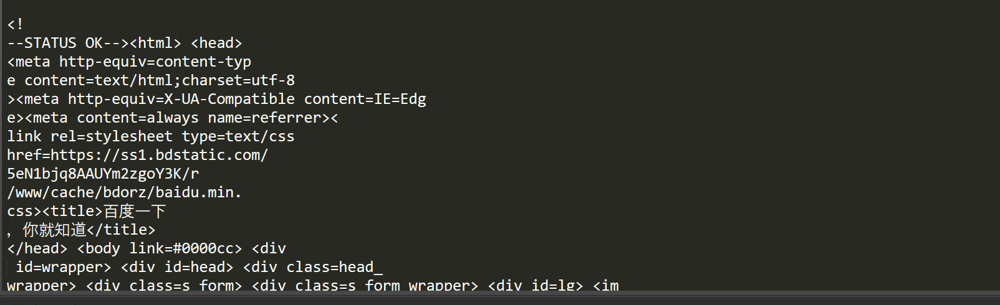

## requests分段下载文件

> 默认情况下，requests当你进行网络请求后，响应体会立即被下载，当数据过大时会导致内存不足。

### 这时候可以通过 `stream` 参数来设置请求数据。

> 当在请求上设置stream=True时，这避免了立即将内容读入内存以获得较大的响应。推迟下载响应体直到访问 `Response.content` 属性。
>
> 如果`stream=False`(默认)，数据将作为单个块返回。

```python
url = 'https://www.baidu.com/'
r = requests.get(url, stream=True)
```

此时仅有`响应头`被下载下来了，连接保持打开状态。直到访问 `Response.content`

```python
content = r.content
```

此时才能获取到数据。

`注意：`

> 如果你在请求中把 `stream` 设为 `True`，Requests 无法将连接释放回连接池，除非你 消耗了所有的数据，或者调用了 `Response.close`。 这样会带来连接效率低下的问题。如果你发现你在使用 `stream=True` 的同时还在部分读取请求的 body（或者完全没有读取 body），那么你就应该考虑使用 with 语句发送请求，这样可以保证请求一定会被关闭：

```python
with requests.get(url, stream=True) as r:
    content = r.content
```

这个时候也没有解决问题。

如何一段段的请求数据呢？

#### 1、流式请求

> 流式请求就是像流水一样，不是一次过来而是一点一点“流”过来。处理流式数据也是一点一点处理。

可以使用`Response.iter_lines()` 或 `Response.iter_content()`

iter_content(*chunk_size = 1* , *decode_unicode = False*)

>迭代响应数据。这避免了立即将内容读入内存以获得较大的响应。`chunk_size`是它应该读入内存的字节数。`chunk_size`的类型必须是`int`或`None`。`None`的值将根据流的值发挥不同的作用。

iter_lines(*chunk_size=512*, *decode_unicode=None*, *delimiter=None*)

> 遍历响应数据,一次一行。 

这两个都要设置 `steam=True`才能使用

```python
import requests
url = 'https://www.baidu.com/'
r = requests.get(url, stream=True)
# iter_lines
# 一行一行的读取数据
for line in r.iter_lines():
    if line:
        decoded_line = line.decode('utf-8')
        print('line:', decoded_line)
```


```python
# iter_content，指定每次读取大小
for chunk in r.iter_content(chunk_size=20):
	 if chunk:
            decoded_chunk = chunk.decode('utf-8')
            print(decoed_chunk)
```



#### 2、自己设置请求位置

当设置steam=True时，没有访问 `Response.content`，时，只是得到了请求头。

在请求头里有一个参数：`content-Length`，获取文件长度。 

当有`content-Length`时，就可以在请求头里设置每次请求位置。这要用到： `Range` 字段

没有`content-Length`不能使用

```python
# 设置请求视频开始:start和结束:end的位置
headers = {
    'Range': f'bytes={start}-{end}',
}
r = requests.get(url, headers=headers)
```
#### 3、两个可以结合起来使用多线程

获取文件长度

```python
with requests.get(url, stream=True) as r:
    content_length = r.headers['content-Length']
```

处理每个请求的大小：

```python
all_thread = 4    # 线程数量
part = content_length // all_thread   # 每个线程请求的大小
for i in range(all_thread):
    # 每个线程开始， 结束爬取的位置
    start = part * i
    if i == all_thread - 1:
        end = content_length
    else:
        end = start + part
    if i > 0:
        start += 1
        # 设置从网站请求视频开始和结束的位置
    headers = {
        'Range': f'bytes={start}-{end}',
              }
    yield headers, start, end
```

发起请求：

```python
with requests.get(url, stream=True, headers=headers) as r:
    with open(path, 'rb+') as f:   # path 文件保存路径
        # 从文件的start位置开始写入
        f.seek(start)
        for chunk in response.iter_content(chunk_size=1024):
            if chunk:
                f.write(chunk)
```


