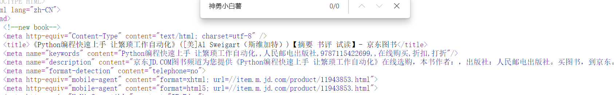
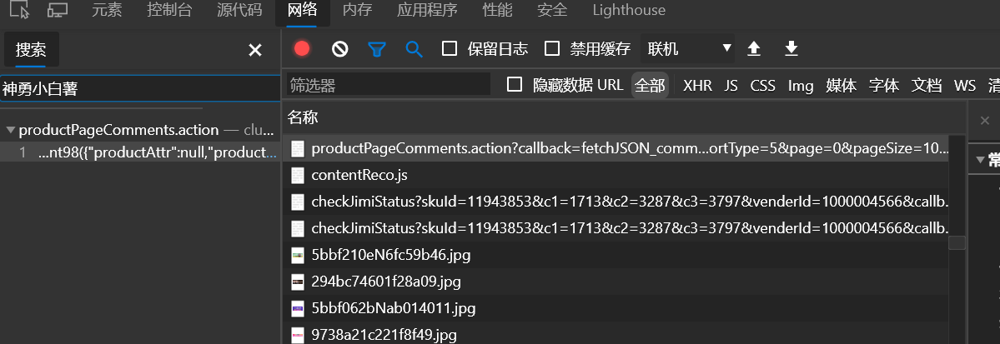
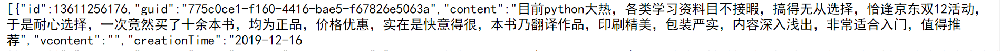
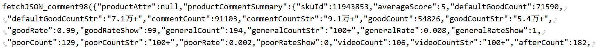
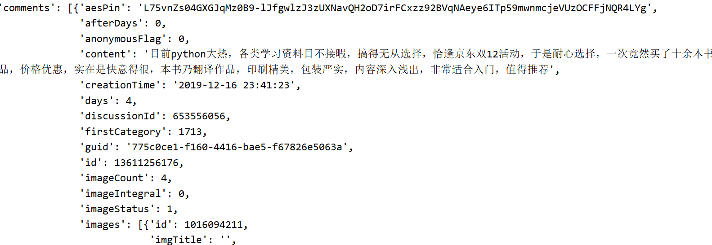
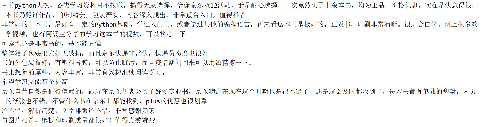

### 评论获取
爬取商品：https://item.jd.com/11943853.html

#### 一、评论查找
源代码查找

随便复制一个评论的评论人：名字。在源代码中搜索，没有。



那就在加载的数据中查找



在这个里面有：

> https://club.jd.com/comment/productPageComments.action?callback=fetchJSON_comment98&productId=11943853&score=0&sortType=5&page=0&pageSize=10&isShadowSku=0&fold=1

看看是不是评论：




有评论的内容。

### 二、评论内容获取。

请求得到数据, 数据格式：



使用正则，再使用json.loads把数据转化为字典类型：

```python
 resp = requests.get(url, headers=headers)
    if resp.status_code == 200:
        text = resp.text
        pattern = re.compile(r'fetchJSON_comment98\((.*?)\);', re.S)
        t_data = pattern.search(text).group(1)
        t_json = json.loads(t_data)
        pprint(t_json)
```



评论在comments的content里面：

```python
for comment in t_json['comments']:
	print(comment['content'])
```



### 三、全部评论获取

> https://club.jd.com/comment/productPageComments.action?callback=fetchJSON_comment98&productId=11943853&score=0&sortType=5&page=0&pageSize=10&isShadowSku=0&fold=1

在这个地址了page参数代表页码：改变page的值可以获取不同页码的评论。

还有一个productId代表每个商品。