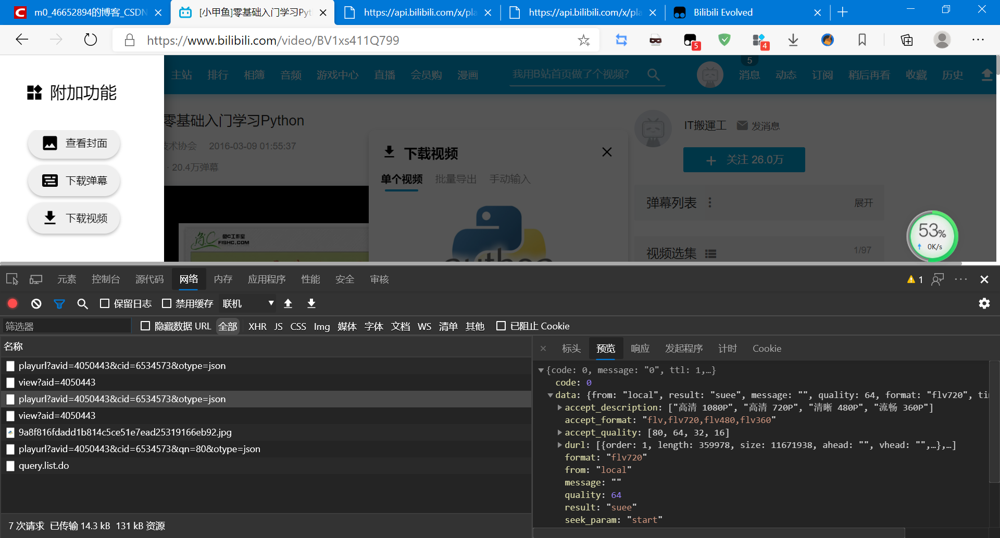
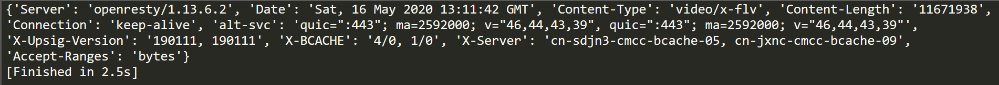
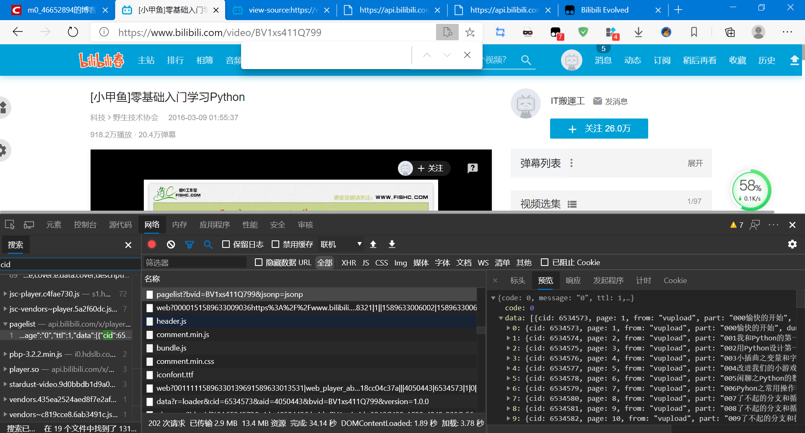
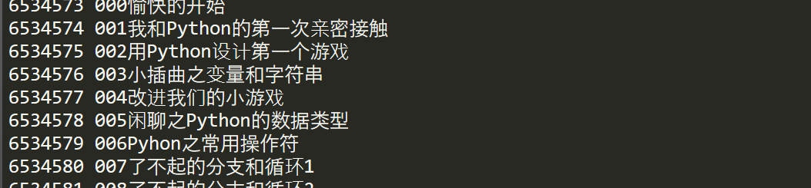

## 哔哩哔哩视频爬取

爬取地址：https://www.bilibili.com/video/BV1xs411Q799

#### 视频地址获取

在：https://api.bilibili.com/x/player/playurl?avid=4050443&cid=6534573&otype=json

> 我不知道怎么来的 ⊙﹏⊙，正常请求找不到。是用了油猴插件**Bilibili Evolved**



其中avid是固定的就是av号，而cid是每个视频的不一样。

```python
import requests
from pprint import pprint

headers = {
    'User-Agent': 'Mozilla/5.0 (Windows NT 10.0; Win64; x64) AppleWebKit/537.36 (KHTML, like Gecko) Chrome/81.0.4044.138 Safari/537.36 Edg/81.0.416.72',
    'referer': 'https://www.bilibili.com/video/'
}
url = 'https://api.bilibili.com/x/player/playurl?avid=4050443&cid=6534573&otype=json'
resp_json = requests.get(url).json()
durl_list = resp_json['data']['durl']
url = durl_list[0]['url']
pprint(requests.get(url, headers=headers, stream=True).headers)
```

headers一定要设置



#### 获取cid

这个很容易获取，刷新网页搜索就好了：



可以请求这个地址得到：https://api.bilibili.com/x/player/pagelist?bvid=BV1xs411Q799&jsonp=jsonp

```python
url = 'https://api.bilibili.com/x/player/pagelist?bvid=BV1xs411Q799&jsonp=jsonp'
resp_json = requests.get(url).json()
# pprint(resp_json)
data_lsit = resp_json['data']
for data in data_lsit:
    cid = data['cid']
    name = data['part']
    print(cid, name)
```

