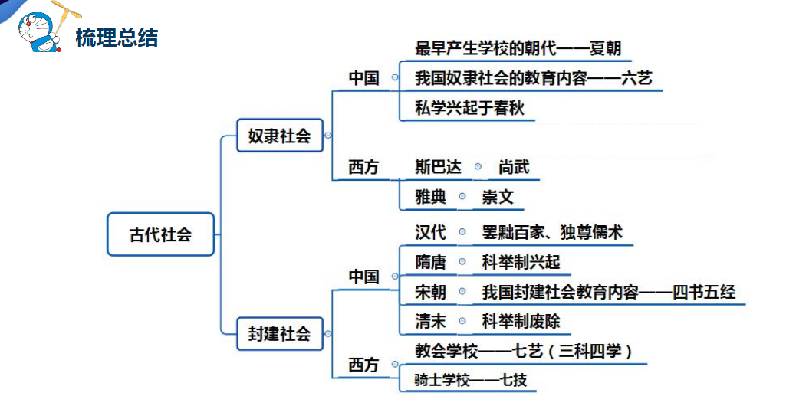

### 狭义的教育
- 学校教育，是**<u>教育者</u>**根据一定的社会要求，<u>**有目的、有计划、有组织**</u>地对<u>**受教育者**</u>施加<u>**影响**</u>，把他们培养成一定社会所需要的人的活动。(三有三要素)

- 教育者：主导地位
- 受教育者：主体地位
- 教育影响：（纽带、中介

### 教育的本质属性：教育是有目的培养人的社会活动

### 教育的显性功能和隐性功能

- 教育的显性功能指教育活动依照教育目的，在实际运行中所出现的与之相吻合的结果。如促进人的和谐发展、促进社会进步等，就是显性教育功能的表现。显性功能的主要标志是<u>**计划性**</u>。
  - 理解：显性功能的主要标志是计划性，因此，教育的个体发展、政治、经济等功能均属于教育的显性功能。

- 教育的隐性功能指伴随显性教育功能所出现的**<u>非预期性</u>**的功能。
  - 理解：隐形功能的显著标志是非计划性、非预期性，例如教师的行为方式、学校文化、社会环境。

- 联系：显性功能与隐性功能的区分是相对的，一旦隐性的潜在功能被有意识地开发、利用，就可以转变成显性教育功能。例如，通过小组合作提高了学生的合作意识，这是隐性功能，班会讨论合作，就变成了显性功能。

###  古代社会的教育

### 请简述20世纪以后教育的特点。

- 1.教育的**<u>终身化</u>**。它包括各个年龄阶段的各种方式的教育。
- 2.教育的**<u>全民化</u>**。教育必须面向所有的人，即人人都有接受教育的权利。
- 3.教育的**<u>民主化</u>**。教育民主化是对教育的等级化、特权化和专制化的否定。
- 4.教育的**<u>多元化</u>**。具体表现为培养目标的多元化、办学形式的多元化等。
- 5.教育的**<u>现代化</u>**。教育的现代化是指现代科学技术在教育上的运用，并由此引起教育思想、教育观念的变化。

